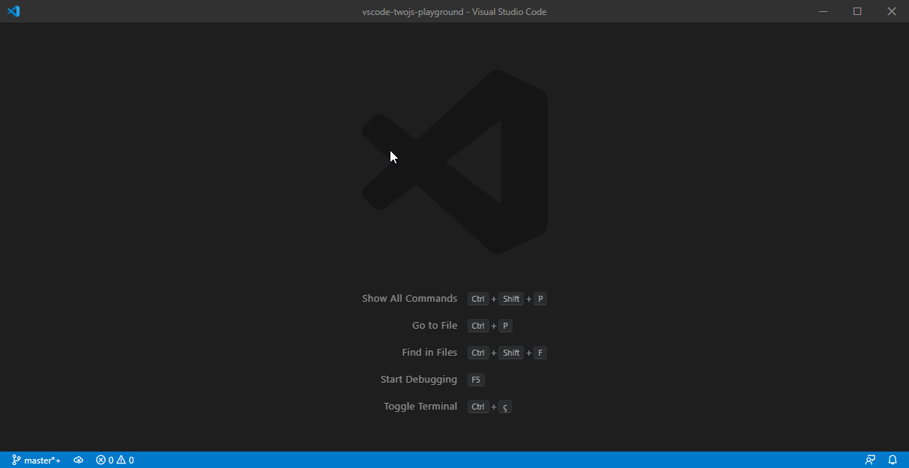

# Two.js Playground for Visual Studio Code

This project provides a Visual Studo Code extension that can be used to automatically preview code using the two-dimensional drawing library [Two.js] .

[Two.js]: https://two.js.org/




## How to Install
Launch VS Code Quick Open (Ctrl + P), paste the following command, and press enter:

ext install joaompinto.twojs-playground

Alternatively you can use the built-in extension browser to find the Two.JS by joaompinto extension and install it.

## How to Use

- Press CTRL + N (To open a new file)
- Press CTRL + K followed by M (Select "JavaScript")
- Press CTRL + . (type: twojs and select a snippet)
- Press F1: (type: TwoKS...)


## Using the extension from source

```bash
git clone https://github.com/joaompinto/vscode-twojs-playground
code vscode-twojs-playground
```

From VSCode:

    View -> Terminal

In the terminal execute:
```bash
npm install
```

Press F5 to to run the Extension

From the new VSCode perform the "How to use" procedure.


## Build and install the extension from source
```bash
npm install
node_modules/vsce/out/vsce package
code --install-extension *.vsix
```

## Credits
This extension is only possible thanks to https://two.js.org/, the snippets were obtained from https://two.js.org/#basic-usage .
